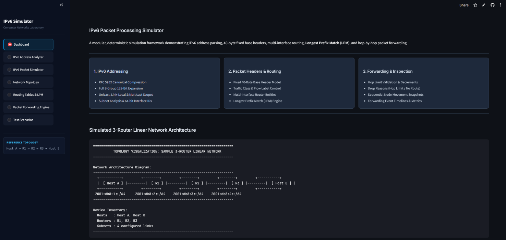
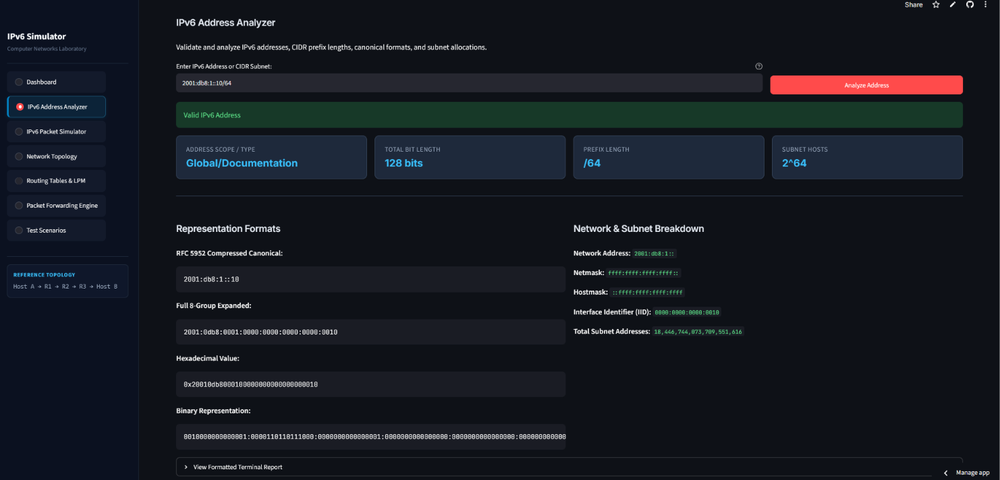
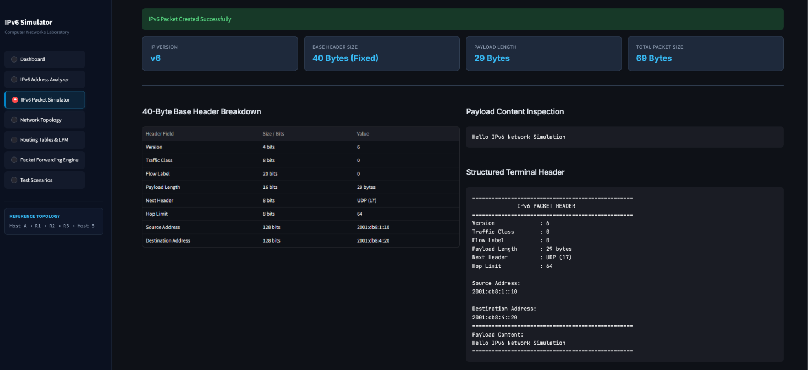
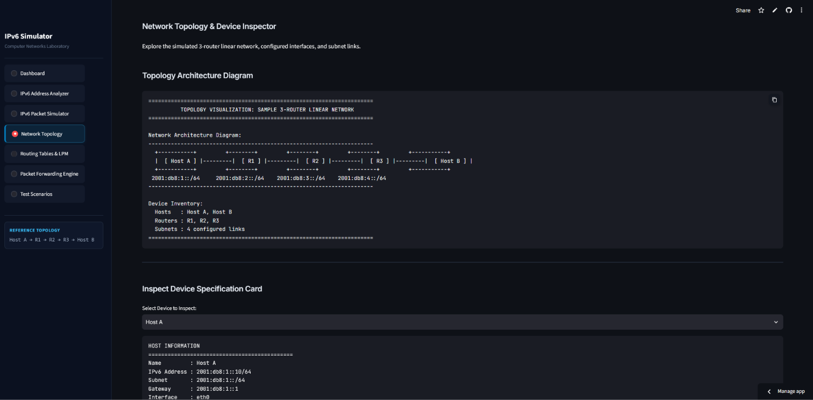
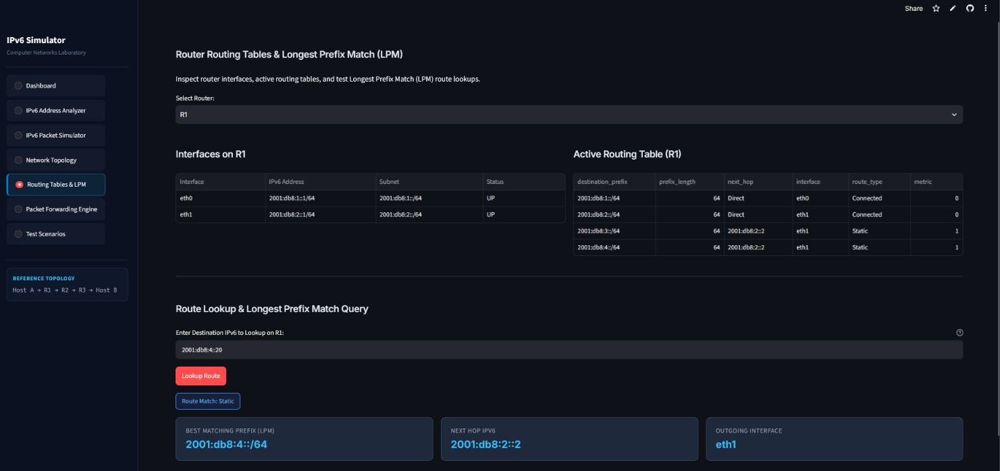
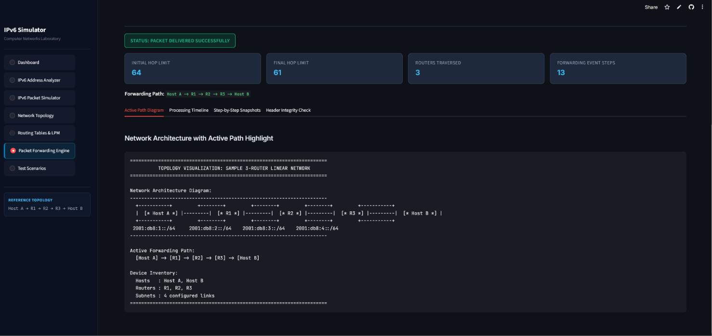
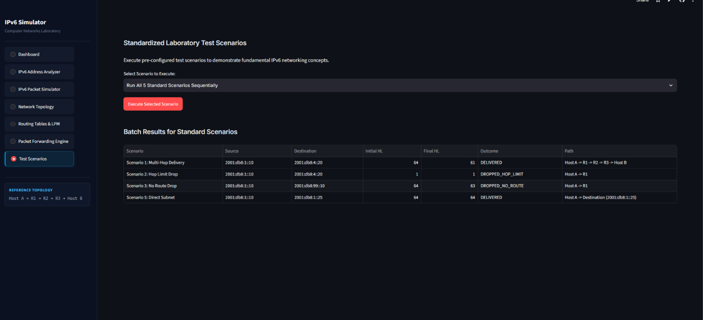

# IPv6 Packet Processing Simulator

> An interactive simulator for IPv6 addressing, packet headers, routing, Longest Prefix Match, and packet forwarding.

[](https://www.python.org/)
[](https://streamlit.io/)
[]()
[](LICENSE)

---

## Live Demo

- **Live Streamlit Demo:** [https://ipv6-packet-processing-simulator.streamlit.app/](https://ipv6-packet-processing-simulator.streamlit.app/)

---

## Project Overview

The **IPv6 Packet Processing Simulator** is a Python-based educational simulation framework designed for computer networks laboratory study. It demonstrates how IPv6 packets are:

$$\text{Created} \longrightarrow \text{Processed} \longrightarrow \text{Routed} \longrightarrow \text{Forwarded} \longrightarrow \text{Delivered / Dropped}$$

The application operates over a simulated network environment of virtual hosts and multi-interface routers rather than transmitting physical packets over a live network. It allows students and instructors to inspect IPv6 address mechanics, 40-byte base headers, routing tables, Longest Prefix Match (LPM), and hop-by-hop forwarding logic in both a **Streamlit Web Interface** and a **Terminal CLI**.

---

## Key Features

- **IPv6 Addressing & Analysis**:
  - IPv6 address validation and syntax error checking.
  - RFC 5952 canonical compression (`::`) and 8-group 128-bit expansion.
  - Address classification (Global Unicast, Link-Local, Unique Local, Multicast, Loopback, Unspecified, Documentation).
  - IPv6 prefix/network analysis, netmasks, hostmasks, interface identifiers (IID), and subnet address counts.

- **IPv6 Packet & Header Simulation**:
  - IPv6 packet creation with fixed 40-byte base header modeling.
  - Configurable Traffic Class (0–255) and Flow Label (0–1,048,575).
  - Next Header protocol selection (UDP, TCP, ICMPv6, No Next Header).
  - Hop Limit handling and dynamic payload length calculation.

- **Routing & Forwarding Engine**:
  - Simulated virtual hosts and multi-interface routers.
  - IPv6 routing tables with connected and static route registration.
  - Longest Prefix Match (LPM) route lookup algorithm.
  - Hop-by-hop packet forwarding with Hop Limit decrements.
  - Accurate packet delivery and packet-drop simulation (`DROPPED_HOP_LIMIT`, `DROPPED_NO_ROUTE`).

- **Visualization & User Interface**:
  - Interactive browser-based Streamlit web interface.
  - Terminal-based interactive dashboard and standalone demo mode.
  - ASCII network topology visualization with active forwarding path highlighting.
  - Sequential packet movement snapshots, event logs, and forwarding statistics.
  - 5 pre-configured laboratory demonstration scenarios.

---

## Computer Networks Concepts Demonstrated

- **IPv6 Addressing**: 128-bit address representation, canonical zero-compression rules, CIDR subnetting.
- **IPv6 Header Structure**: Fixed 40-byte base header, absence of header checksum, flow control fields.
- **IPv6 Packet Processing**: Payload length calculation, protocol multiplexing via Next Header.
- **Routing**: Connected route generation, static routing table management.
- **Longest Prefix Match (LPM)**: Selecting the most specific prefix match among overlapping routes.
- **Next-Hop Selection**: Resolving next-hop IP and egress interface.
- **Hop Limit**: Loop prevention mechanism and expiration handling.
- **Packet Forwarding**: Hop-by-hop transmission across multi-router transit paths.
- **Packet Delivery & Dropping**: Direct subnet delivery versus forwarding failure modes.
- **Network Topology**: Linear multi-router network architecture with isolated subnets.

---

## System Workflow

```text
                 User Input
                     ↓
          IPv6 Address Validation
                     ↓
            IPv6 Packet Creation
                     ↓
          IPv6 Header Processing
                     ↓
                Source Host
                     ↓
           Router Receives Packet
                     ↓
             Check Destination
                     ↓
              Check Hop Limit ──────────[ Hop Limit <= 1 ]─────────→ Packet Dropped (Hop Limit Expired)
                     ↓
           Routing Table Lookup
                     ↓
           Longest Prefix Match ────────[ No Matching Route ]─────→ Packet Dropped (No Route)
                     ↓
              Select Next Hop
                     ↓
            Decrement Hop Limit
                     ↓
               Forward Packet
                     ↓
            Destination Reached?
               ↙           ↘
             Yes            No
              ↓              ↓
           Deliver   Continue Forwarding
```

---

## Sample Network Topology

The simulator models a reference linear 3-router, 4-subnet network architecture:

```text
[ Host A ] (2001:db8:1::10/64) -- Default Gateway: 2001:db8:1::1
    |
  (Subnet: 2001:db8:1::/64)
    |
[ Router R1 ]
    ├── eth0: 2001:db8:1::1/64   [Connected: 2001:db8:1::/64 -> Direct]
    └── eth1: 2001:db8:2::1/64   [Connected: 2001:db8:2::/64 -> Direct]
                                 [Static:    2001:db8:3::/64 -> 2001:db8:2::2 via eth1]
                                 [Static:    2001:db8:4::/64 -> 2001:db8:2::2 via eth1]
    |
  (Subnet: 2001:db8:2::/64)
    |
[ Router R2 ]
    ├── eth0: 2001:db8:2::2/64   [Connected: 2001:db8:2::/64 -> Direct]
    └── eth1: 2001:db8:3::1/64   [Connected: 2001:db8:3::/64 -> Direct]
                                 [Static:    2001:db8:1::/64 -> 2001:db8:2::1 via eth0]
                                 [Static:    2001:db8:4::/64 -> 2001:db8:3::2 via eth1]
    |
  (Subnet: 2001:db8:3::/64)
    |
[ Router R3 ]
    ├── eth0: 2001:db8:3::2/64   [Connected: 2001:db8:3::/64 -> Direct]
    └── eth1: 2001:db8:4::1/64   [Connected: 2001:db8:4::/64 -> Direct]
                                 [Static:    2001:db8:1::/64 -> 2001:db8:3::1 via eth0]
                                 [Static:    2001:db8:2::/64 -> 2001:db8:3::1 via eth0]
    |
  (Subnet: 2001:db8:4::/64)
    |
[ Host B ] (2001:db8:4::20/64) -- Default Gateway: 2001:db8:4::1
```

---

## Technology Stack

| Technology | Purpose |
| :--- | :--- |
| **Python 3.10+** | Core simulation implementation |
| **`ipaddress`** | IPv6 address, interface, and CIDR network calculations |
| **Streamlit** | Interactive browser-based web interface |
| **pytest** | Automated unit and integration testing suite |
| **Git** | Version control and source code tracking |
| **GitHub** | Repository hosting and documentation |

---

## Project Structure

```text
ipv6-packet-processing-simulator/
│
├── src/
│   ├── __init__.py            # Package initialization & module exports
│   ├── ipv6_address.py        # IPv6 address validation, parsing & classification
│   ├── ipv6_packet.py         # 40-byte base header model & packet construction
│   ├── routing_table.py       # RoutingTable with Longest Prefix Match (LPM)
│   ├── router.py              # Router & RouterInterface management
│   ├── host.py                # Host & Link models
│   ├── network.py             # NetworkTopology & reference topology builder
│   ├── forwarding.py          # Hop-by-hop packet forwarding engine
│   └── visualization.py       # Visual diagrams, timelines, snapshots & stats
│
├── tests/
│   ├── test_ipv6_address.py   # Address module unit tests (44 tests)
│   ├── test_ipv6_packet.py    # Packet & header unit tests (42 tests)
│   ├── test_routing_table.py  # Routing table & LPM tests (12 tests)
│   ├── test_router.py         # Router, interface & topology tests (11 tests)
│   ├── test_forwarding.py     # Packet forwarding engine tests (8 tests)
│   ├── test_visualization.py  # Visualization & formatting tests (10 tests)
│   └── test_scenarios.py      # Standardized scenario tests (5 tests)
│
├── docs/
│   ├── architecture.md        # Technical architecture specification
│   └── test-scenarios.md      # Detailed scenario documentation & traces
│
├── screenshots/
│   ├── dashboard.png          # Streamlit Dashboard view
│   ├── ipv6-address-analyzer.png # Address Analyzer view
│   ├── ipv6-header.png        # Packet & Header view
│   ├── network-topology.png   # Topology & Device Inspector view
│   ├── routing-table.png      # Routing Tables & LPM view
│   ├── successful-forwarding.png # Forwarding simulation view
│   └── packet-drop.png        # Hop Limit drop simulation view
│
├── app.py                     # Interactive terminal application & CLI suite
├── streamlit_app.py           # Interactive Streamlit Web Application
├── demo.py                    # Standalone zero-input lab demonstration script
├── requirements.txt           # Project dependencies
├── README.md                  # Project overview and documentation
├── LICENSE                    # MIT open-source license
└── .gitignore                 # Git ignore rules
```

---

## How to Run Locally

### 1. Clone the Repository & Setup
```bash
git clone https://github.com/DineshMoorthy007/ipv6-packet-processing-simulator.git
cd ipv6-packet-processing-simulator
pip install -r requirements.txt
```

### 2. Run the Streamlit Web Application
```bash
streamlit run streamlit_app.py
```
*Access the web interface in your browser at `http://localhost:8501`.*

### 3. Run the Terminal Application
```bash
python app.py
```

### 4. Run the Zero-Input Demonstration
```bash
python demo.py
```

---

## Testing

The project includes an automated test suite executed with `pytest`:

```bash
pytest tests/ -v
```

### Test Suite Summary

- **Address Engine** (`tests/test_ipv6_address.py`): 44 tests passed.
- **Packet & Header** (`tests/test_ipv6_packet.py`): 42 tests passed.
- **Routing Tables & LPM** (`tests/test_routing_table.py`): 12 tests passed.
- **Router & Interfaces** (`tests/test_router.py`): 11 tests passed.
- **Forwarding Engine** (`tests/test_forwarding.py`): 8 tests passed.
- **Visual Formatting** (`tests/test_visualization.py`): 10 tests passed.
- **Standard Scenarios** (`tests/test_scenarios.py`): 5 tests passed.
- **Total:** **132 / 132 tests passed (100% pass rate)**.

---

## Demonstration Scenarios

| Scenario | Description | Expected Result |
| :--- | :--- | :--- |
| **Valid IPv6 Packet** | User inputs valid IPv6 parameters and payload | Packet created with 40-byte base header |
| **Successful Forwarding** | Transit from `Host A` to `Host B` with $HL=64$ | Packet delivered via `R1 -> R2 -> R3` ($HL: 64 \to 61$) |
| **Hop Limit Expiration** | Packet sent with initial $HL=1$ | Packet dropped at `R1` (`DROPPED_HOP_LIMIT`) |
| **No Matching Route** | Destination set to unroutable prefix `2001:db8:99::10` | Packet dropped at `R1` (`DROPPED_NO_ROUTE`) |
| **Longest Prefix Match** | Route lookup with `/32`, `/48`, and `/64` matches | Most specific prefix (`/64`) selected |
| **Direct Subnet Delivery** | Destination on same local subnet (`2001:db8:1::25`) | Delivered locally without intermediate router hops |

---

## Screenshots

### Dashboard


### IPv6 Address Analyzer


### IPv6 Packet Header


### Network Topology


### Routing Table & LPM


### Successful Packet Forwarding


### Packet Drop Simulation


---

## Results

The simulator demonstrates IPv6 packet processing and multi-hop forwarding mechanics:
- IPv6 address validation, RFC 5952 canonical formatting, and 128-bit binary expansion.
- Construction and validation of the fixed 40-byte IPv6 base header.
- Automated generation of connected routes and Longest Prefix Match (LPM) lookup resolution.
- Router-by-router forwarding with sequential Hop Limit decrements across intermediate routers.
- Correct handling of packet drop conditions (Hop Limit expiration and missing routing table entries).

---

## Limitations

- **Simulated Environment**: Packets and network links are simulated programmatically in Python rather than transmitted over physical hardware.
- **Static Route Tables**: Routes are configured statically in the reference topology rather than exchanged via dynamic routing protocols.
- **Protocol Scope**: Focuses on core unicast packet processing and forwarding; advanced features such as extension header chains and fragmentation are not part of the base simulation.

---

## Future Enhancements

- **Dynamic Routing Protocols**: Integration of simulated RIPng or OSPFv3 route exchange.
- **ICMPv6 Protocol Modeling**: Generation of ICMPv6 Time Exceeded and Destination Unreachable messages.
- **Neighbor Discovery Protocol (NDP)**: Simulation of Router Advertisements (RA) and Neighbor Solicitations (NS).
- **IPv6 Extension Headers**: Hop-by-Hop Options, Routing Headers, and Fragmentation headers.
- **Dynamic Topology Builder**: User-defined router and host topology creation via UI.

---

## Project Documentation

Detailed technical references and data flow specifications are available in the [`docs/`](docs/) directory:
- [`docs/architecture.md`](docs/architecture.md) — System architecture, module specifications, and data flow.
- [`docs/test-scenarios.md`](docs/test-scenarios.md) — Complete scenario test vectors, logs, and verification steps.

---

## Academic Mini-Project Context

- **Course:** Computer Networks Laboratory
- **Project:** IPv6 Packet Processing Simulator
- **Focus Areas:** IPv6 Addressing, Packet Headers, Routing Tables, Longest Prefix Match, Packet Forwarding, Network Simulation

---

## License

This project is open-source software licensed under the terms of the [MIT License](LICENSE).
